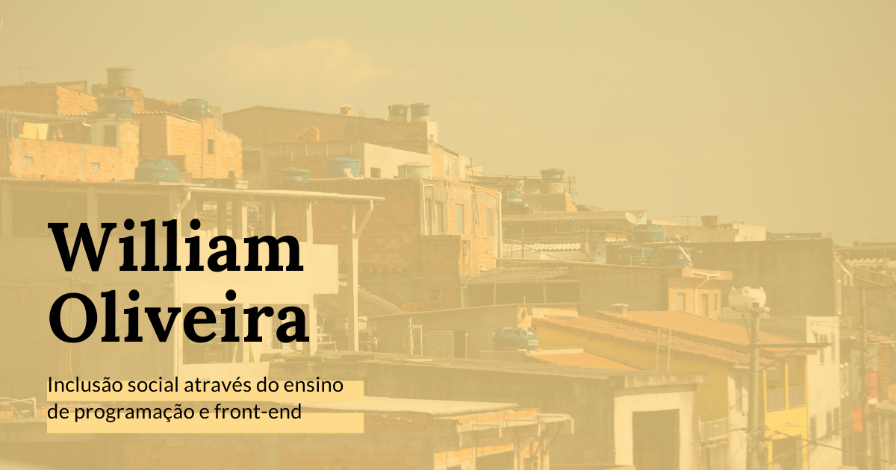

# William Oliveira

> Pintor de software

Experiência de Usuário, performance, acessibilidade, SEO.

   

  
  

## Projetos legais 🧙‍♂️

### [MEU BLOG](http://woliveiras.com.br/)

Conteúdo sobre frontend, carreira e um pouco mais.

### [IMPACTO SOCIAL](http://woliveiras.com.br/apoio-social/)

Apoio a pessoas de baixa renda, moradores de periferia e pessoas em situação de vulnerabilidade social que desejam entrar na área de programação.

### [LINGUAGEM NEUTRA DEV](http://woliveiras.com.br/linguagem-neutra)

Glossário de termos da área de desenvolvimento de software com linguagem neutra.

---

### [Cursos de programação](https://www.twitch.tv/uillaz)

Ensinando desenvolvimento de software de maneira acessível e inclusiva

Todos os cursos são ministrados ao vivo na Twitch.tv no canal: twitch.tv/uillaz.

## Recomendações pessoais

Dicas para seu crescimento profissional.

- [livros](https://woliveiras.com.br/posts/livros-que-todo-programador-iniciante-deveria-ler/)
- [livecoders](https://twitter.com/girlslivecoders)
- [Vários cursos](https://woliveiras.com.br/my-precious-links)

<!-- 

## Depoimentos 💓

### O que dizer desse cara que eu mal conheço e já admiro pacas?

Um cara bacana, compromissado, consciente, tem gatos fofos, mora na ZS, tudo de bom.

> Não precisa aceitar esse PR hahahah

[@Ju Amoasei](https://github.com/JulianaAmoasei)

-->
